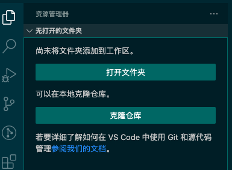
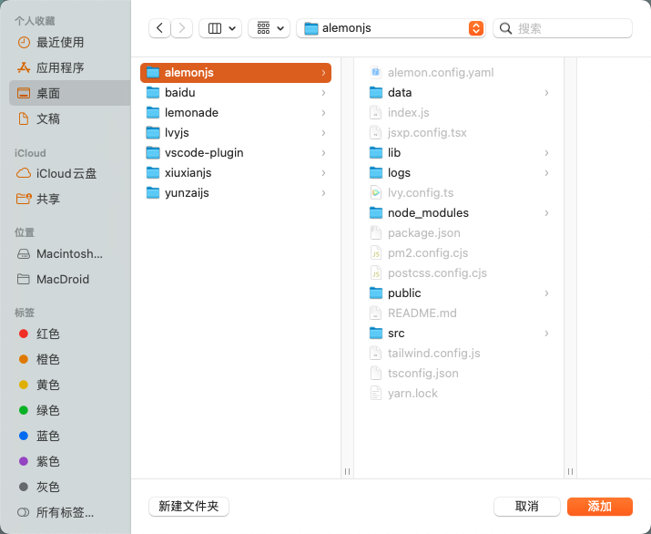
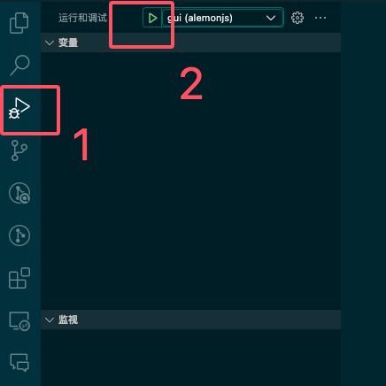
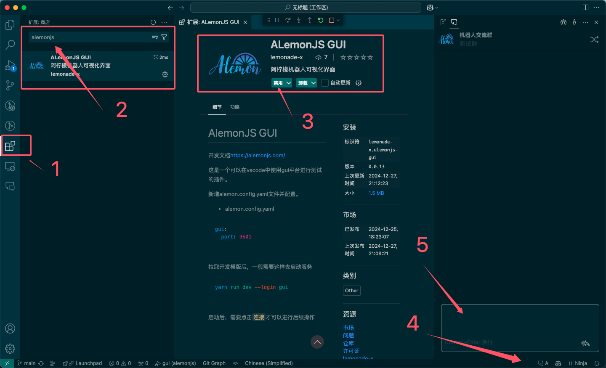

# 阿柠檬鸣潮应用

开发文档 [https://alemonjs.com/](https://alemonjs.com/)

## 使用指南

### 配置

> alemon.config.yaml

```yaml
apps:
  - "alemonjs-kuromc"
```

#### 1.下载模块


```sh
yarn add alemonjs-kuromc 
```

#### 2。本地模块

```sh
# clone
git clone --depth=1  git@github.com:lemonade-lab/kuromc.git
# build
npm install
npm run build
# link
npm link
```

> 在想要载入的机器人目录进行

```sh
npm link alemonjs-kuromc 
```

> 如果你要本地立即启动

```sh
node index.js
```

## VScode开发指南




